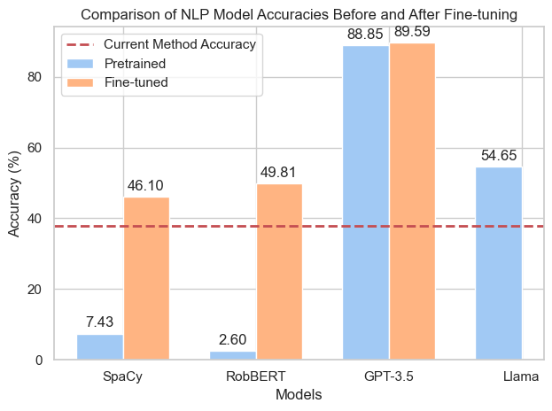

# ComplianceMonitoringNLP



This repository contains all scripts, configurations, and data for my master thesis.

## Directory Structure
1. [**scripts/**](scripts/): Scripts for performing experiments.
2. [**src/**](src/): Supporting code, including EDA, data cleaning and the scraper code.
3. [**data/**](data/): Data and saved models

## Installation
You can install this repository by following these steps:

1. Clone the repository:
   ```sh
   git clone https://github.com/San-mtn/ComplianceMonitoringNLP.git

2. Install the requirements:
   ```sh
   pip install -r requirements.txt

## Usage
The **scripts/** folder contains separate notebooks for each NLP model used in the experiments of enhancing compliance monitoring through the application of advanced NLP techniques (SpaCy, RobBERT, GPT-3.5, Llama). Each notebook is self-contained and covers the full setup and execution of the experiment:
* Installation of requirements: Each notebook begins with the setup required to run the experiments, including the installation of necessary Python packages.
* Importing the Data: The data from the [**data/**](data/) folder is imported and ready to use.
* Model Training and Fine-tuning: Detailed steps on how to traine and fine-tune each model on the provided data, tailored to the specific characteristics and requirements of the Dutch language compliance documents.
* Inference and Evaluation: Each notebook includes scripts for performing inference with the trained models and evaluating their performance against a test dataset. This includes detailed commands on how to run the models and interpret the output.
* Compliance Monitoring Pipeline: To facilitate the practical application in compliance monitoring, the notebooks provide a guided approach to using these models to identify and categorize organization names within financial documents.

## Running the Notebooks
To execute the experiments within any of the provided notebooks, follow these steps:
1. Prepare the environment:
   Ensure Python is installed. Clone this repository and navigate to the desired notebook:
   ```sh
   git clone https://github.com/San-mtn/ComplianceMonitoringNLP.git

2. Install dependencies:
   Install the required Python libraries using pip:
   ```sh
   pip install -r requirements.txt

3. Download Data:
   Download the necessary datasets from the [**data/**](data/) folder as described in each notebook.

4. Run the notebooks:
   Open Jupyter Notebook for the model you are interested in:
   ```sh
   jupyter notebook spacy_model.ipynb'''
   Repeat for robbert_model.ipynb, gpt_3_5_model.ipynb, and llama_model.ipynb as required.

## Acknowledgements

